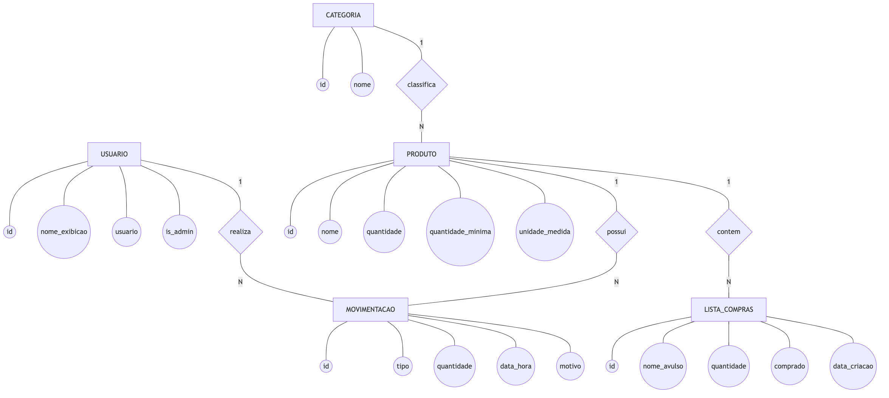
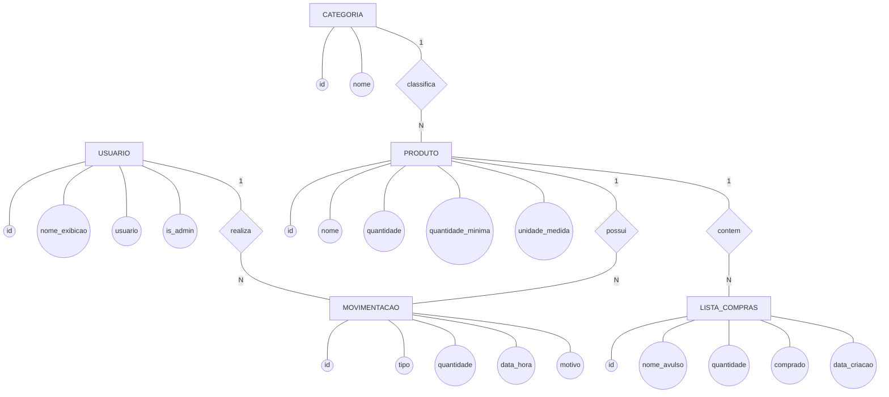

# DER — Diagrama Entidade-Relacionamento (Conceitual / Notação Chen)

Representação **conceitual** do banco do **Panela de Barro**, na notação de
Peter Chen: **retângulo** = entidade, **elipse** = atributo, **losango** = relação.

> Diferença para o [MER lógico](mer.md): aqui não há tipo de dado nem chave
> estrangeira — é o modelo abstrato. O [mer.md](mer.md) mostra o modelo lógico
> (tabelas, tipos, PK/FK), pronto pra virar banco.

---

## Diagrama (notação Chen aproximada)

Código-fonte Mermaid do diagrama

> O número nas linhas (`1` … `N`) é a **cardinalidade**: lado `1` participa uma
> vez, lado `N` participa muitas. Ex: `CATEGORIA 1 — classifica — N PRODUTO`.

---

## Entidades e atributos

| Entidade | Atributos | Identificador (PK) |
|---|---|---|
| **USUARIO** | id, nome_exibicao, usuario, senha_hash, is_admin, data_criacao | id |
| **CATEGORIA** | id, nome | id |
| **PRODUTO** | id, nome, quantidade, quantidade_minima, unidade_medida | id |
| **MOVIMENTACAO** | id, tipo, quantidade, data_hora, motivo | id |
| **LISTA_COMPRAS** | id, nome_avulso, quantidade, comprado, data_criacao | id |

> Atributo sublinhado/chave = `id` em todas. `usuario` e `nome` (categoria) são
> atributos **únicos** (candidatos a chave).

---

## Relacionamentos e cardinalidade

| Relação | Entidades | Cardinalidade | Leitura |
|---|---|---|---|
| **classifica** | CATEGORIA — PRODUTO | 1 : N | Uma categoria classifica vários produtos. |
| **realiza** | USUARIO — MOVIMENTACAO | 1 : N | Um usuário realiza várias movimentações. |
| **possui** | PRODUTO — MOVIMENTACAO | 1 : N | Um produto possui várias movimentações. |
| **contem** | PRODUTO — LISTA_COMPRAS | 1 : N | Um produto consta em vários itens da lista. |

---

## MER × DER — qual é qual aqui

- **DER conceitual (este arquivo):** ideia abstrata. Entidades, atributos,
  relações nomeadas. Sem tipo de dado, sem FK. Notação Chen.
- **MER lógico ([mer.md](mer.md)):** tradução pro banco. Tabelas com tipos,
  PK/FK, NOT NULL, regras de exclusão (CASCADE/SET NULL). Notação pé-de-galinha.

Fluxo normal de projeto: **conceitual (DER) → lógico (MER) → físico (SQL)**.

---

## Dica para apresentar / desenhar à mão

A notação Chem fica mais limpa desenhada no [draw.io](https://draw.io)
(tem formas ER prontas: retângulo, elipse, losango). Passos:

1. Desenhe um **retângulo** por entidade.
2. Pendure **elipses** (atributos) em cada uma; sublinhe a chave (`id`).
3. Ligue duas entidades por um **losango** com o nome da relação.
4. Escreva a cardinalidade (`1`, `N`) em cada ponta da linha.
