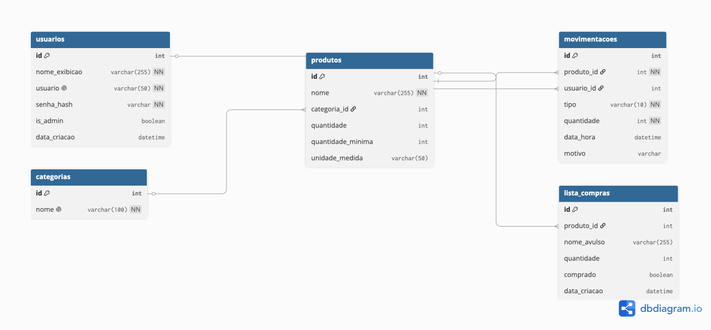

# MER — Modelo Entidade-Relacionamento

Documentação do banco de dados do **Panela de Barro** (controle de estoque + lista de compras).

Gerado a partir dos models SQLAlchemy em [api/models/](../api/models/).

---

## Visão geral

O sistema controla o **estoque de produtos** de um estabelecimento e mantém uma
**lista de compras**. Toda entrada e saída de produto é registrada em um histórico
de **movimentações**, sempre vinculado ao **usuário** que a realizou.

O diagrama tem **5 entidades** (tabelas). O centro é `produtos` — ele conecta
categorias, movimentações e lista de compras.

---

## Como ler o diagrama

### Símbolos ao lado dos campos

| Ícone | Nome | Significado |
|---|---|---|
| 🔑 | PK (Primary Key) | Chave primária. Identifica cada linha de forma única. |
| 🔗 | FK (Foreign Key) | Chave estrangeira. Aponta para o `id` de outra tabela. |
| 👆 | UNIQUE | Valor não pode se repetir na tabela. |
| `NN` | NOT NULL | Campo obrigatório, não aceita vazio. |

### Símbolos nas linhas (cardinalidade)

As pontas de cada linha mostram **quantos** registros se relacionam:

- `||` (traço duplo) = **exatamente um**
- `o<` (pé de galinha) = **zero ou muitos**

Lendo junto: `um ||——< muitos` significa **"um para muitos" (1:N)**.

> Exemplo: a linha entre `categorias` e `produtos` diz que **uma** categoria
> pode ter **muitos** produtos, mas cada produto pertence a **uma só** categoria.

---

## Entidades

### `usuarios`
Quem opera o sistema.

| Campo | Tipo | Observação |
|---|---|---|
| `id` | int | 🔑 PK |
| `nome_exibicao` | varchar(255) | Nome mostrado na tela. Obrigatório. |
| `usuario` | varchar(50) | 👆 Login único. Obrigatório. |
| `senha_hash` | varchar | Senha criptografada (pbkdf2/bcrypt). Obrigatório. |
| `is_admin` | boolean | Se é administrador. Padrão `false`. |
| `data_criacao` | datetime | Data de cadastro. |

### `categorias`
Agrupamento de produtos (ex: limpeza, alimento, bebida).

| Campo | Tipo | Observação |
|---|---|---|
| `id` | int | 🔑 PK |
| `nome` | varchar(100) | 👆 Único. Obrigatório. |

### `produtos`
Itens controlados no estoque. **Entidade central.**

| Campo | Tipo | Observação |
|---|---|---|
| `id` | int | 🔑 PK |
| `nome` | varchar(255) | Obrigatório. |
| `categoria_id` | int | 🔗 FK → `categorias.id` |
| `quantidade` | int | Estoque atual. Padrão `0`. |
| `quantidade_minima` | int | Limite p/ alertar estoque baixo. Padrão `0`. |
| `unidade_medida` | varchar(50) | kg, un, litro... |

### `movimentacoes`
Histórico de cada entrada e saída de produto.

| Campo | Tipo | Observação |
|---|---|---|
| `id` | int | 🔑 PK |
| `produto_id` | int | 🔗 FK → `produtos.id`. Obrigatório. |
| `usuario_id` | int | 🔗 FK → `usuarios.id`. Opcional (pode ficar nulo). |
| `tipo` | varchar(10) | Só aceita `entrada` ou `saida` (CHECK). Obrigatório. |
| `quantidade` | int | Quanto entrou/saiu. Obrigatório. |
| `data_hora` | datetime | Quando ocorreu. |
| `motivo` | varchar | Observação opcional. |

### `lista_compras`
Itens a comprar. Pode referenciar um produto do estoque **ou** ser avulso.

| Campo | Tipo | Observação |
|---|---|---|
| `id` | int | 🔑 PK |
| `produto_id` | int | 🔗 FK → `produtos.id`. Opcional. |
| `nome_avulso` | varchar(255) | Item digitado à mão. Opcional. |
| `quantidade` | int | Quanto comprar. Padrão `1`. |
| `comprado` | boolean | Se já foi comprado. Padrão `false`. |
| `data_criacao` | datetime | Quando foi adicionado. |

---

## Relacionamentos

| # | Entre | Cardinalidade | Chave estrangeira | Ao deletar o "pai" |
|---|---|---|---|---|
| 1 | `categorias` → `produtos` | 1:N | `produtos.categoria_id` | — |
| 2 | `produtos` → `movimentacoes` | 1:N | `movimentacoes.produto_id` | **CASCADE** (apaga junto) |
| 3 | `usuarios` → `movimentacoes` | 1:N | `movimentacoes.usuario_id` | **SET NULL** (mantém histórico) |
| 4 | `produtos` → `lista_compras` | 1:N | `lista_compras.produto_id` | **CASCADE** (apaga junto) |

Em palavras:

1. Uma **categoria** agrupa vários **produtos**; cada produto tem uma só categoria.
2. Um **produto** tem várias **movimentações**; cada movimentação é de um produto.
3. Um **usuário** realiza várias **movimentações**; cada movimentação tem um autor.
4. Um **produto** pode aparecer na **lista de compras** várias vezes.

---

## Decisões de projeto

- **Histórico preservado.** Quando `produto_id` ou `usuario_id` em `movimentacoes`
  usa `SET NULL` no usuário, o registro histórico permanece mesmo se o usuário
  for excluído — o campo só vira nulo. Importante para auditoria.

- **Exclusão em cascata.** Apagar um produto remove automaticamente suas
  movimentações e itens de lista de compras (`CASCADE`), evitando dados órfãos.

- **Lista de compras flexível.** Aceita um produto cadastrado (`produto_id`)
  **ou** um item digitado à mão (`nome_avulso`). Os dois são opcionais, então
  dá pra anotar algo que ainda não está no estoque.

- **Integridade do tipo.** O campo `tipo` em `movimentacoes` tem um `CHECK`
  que só permite `'entrada'` ou `'saida'` — o próprio banco rejeita valor inválido.

---

## Como regenerar o diagrama

1. Abra [docs/mer.dbml](mer.dbml) e copie o conteúdo.
2. Cole em [dbdiagram.io](https://dbdiagram.io).
3. Arraste as tabelas para o layout desejado.
4. **Export → PNG** e substitua [docs/mer.png](mer.png).
